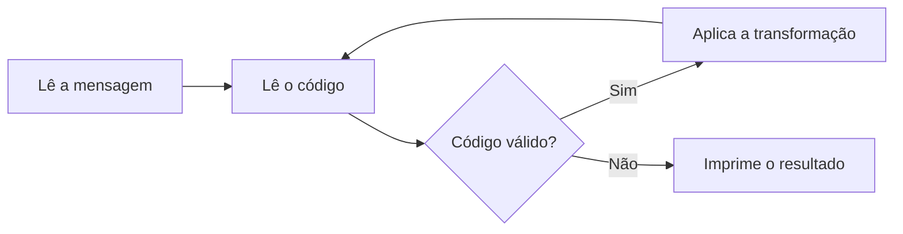

# Mini Projeto 02 - Central de Comunicações Alienígenas

Realizado por: Daniel Pandolfo de Figueiredo e Gabriel Lemos de Oliveira

## Transformações

| Código | Função | O que faz |
|:---:|---|---|
| 1 | `inverter` | Inverte a ordem dos caracteres da mensagem. |
| 2 | `deslocar` | Desloca letras e dígitos `n` posições (cifra de César). Letras giram dentro do alfabeto e mantêm a caixa; dígitos giram entre 0 e 9. Os demais caracteres não mudam. |
| 3 | `trocarParesImpares` | Troca cada caractere de posição par com o seguinte (0↔1, 2↔3, ...). |
| 4 | `inverterCaixa` | Troca maiúsculas por minúsculas e vice-versa. |
| 5 | `rotacionar` | Rotaciona a mensagem `n` posições para a direita. |
| 6 | `trocarMetades` | Troca a primeira metade da mensagem com a segunda. Se o tamanho for ímpar, o caractere do meio permanece no lugar. |

##Estrutura do código

O código está no arquivo functions.c, organizado em três partes:

Protótipos de todas as funções, no topo do arquivo, para que o main possa chamá-las antes das definições.
main, responsável pela leitura da entrada, pelo laço de operações e pela impressão do resultado.
Implementação das funções, uma para cada transformação, mais a função auxiliar tamanho.

