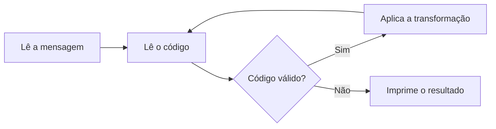

# Mini Projeto 02 — Central de Comunicações Alienígenas

## Identificação

- Daniel Pandolfo de Figueiredo
- Gabriel Lemos de Oliveira

Fraga escrevendo os testes:


## Instruções de compilação e execução

Compilar:

```bash
gcc -Wall -Wextra mp02.c -o mp02
```

Executar digitando a entrada no terminal:

```bash
./mp02
```

## Visão geral do sistema

O programa recebe uma mensagem codificada e uma sequência de códigos de operação. Cada código aplica uma transformação sobre a mensagem, na ordem em que foi informado, e ao final o programa imprime a mensagem decodificada. Apenas a biblioteca `stdio.h` é utilizada.

### Formato da entrada

```text
<mensagem, em uma única linha, podendo conter espaços>
<código> [n]
<código> [n]
...
<0 ou qualquer código inválido>
```

| Código | Função | O que faz |
|:---:|---|---|
| 1 | `inverter` | Inverte a ordem dos caracteres da mensagem. |
| 2 | `deslocar` | Desloca letras e dígitos `n` posições (cifra de César). |
| 3 | `trocarParesImpares` | Troca cada caractere de posição par com o seguinte. |
| 4 | `inverterCaixa` | Troca maiúsculas por minúsculas e vice-versa. |
| 5 | `rotacionar` | Rotaciona a mensagem `n` posições para a direita. |
| 6 | `trocarMetades` | Troca a primeira metade da mensagem com a segunda. |

As operações `2` e `5` recebem em seguida o valor inteiro `n`. A leitura termina com `0` ou com qualquer número que não corresponda a uma operação válida.

### Exemplo

Entrada:

```text
XeSIET M01T PISOD  EEPSSAO SONM NUOD :SAQ EUE TNNEED MIBANIR O ESAQ EUN OA.
3
4
0
```

Saída:

```text
Existem 10 tipos de pessoas no mundo: as que entendem binario e as que nao.
```

### Fluxo de execução da `main`



1. Lê a mensagem inteira com `scanf("%1000[^\n]", s)`.
2. Lê o primeiro código de operação.
3. Enquanto o código estiver entre 1 e 6, um `switch` chama a função correspondente. Nos casos `2` e `5`, o valor de `n` é lido dentro do próprio `case`, antes de chamar a função. Em seguida, lê o próximo código.
4. Quando aparece um código inválido, o laço termina e a mensagem é impressa com `printf("%s\n", s)`.

## Decisões de implementação

### Lógica das funções

Todas as funções recebem um ponteiro para a mensagem e a modificam no próprio vetor, então o `main` não precisa copiar o resultado de volta. Nenhuma função imprime nada: a única saída do programa é o `printf` no final do `main`.

- **`inverter`:** troca o primeiro caractere com o último, o segundo com o penúltimo, e assim por diante até a metade da string. Exemplo: `abcde` → `edcba`.
- **`deslocar`:** cada letra maiúscula gira entre `A` e `Z`, cada minúscula entre `a` e `z` e cada dígito entre `0` e `9`, avançando `n` posições com a fórmula `(c - base + n) % tamanho_do_intervalo + base`. Outros caracteres (espaços, pontuação) não mudam. Exemplo: `Zz9!` com `n = 1` → `Aa0!`.
- **`trocarParesImpares`:** percorre a string de dois em dois, trocando as posições 0↔1, 2↔3, e assim por diante. Se o tamanho for ímpar, o último caractere fica no lugar. Exemplo: `abcde` → `badce`.
- **`inverterCaixa`:** converte usando a tabela ASCII, com `c - 'a' + 'A'` para minúsculas e `c - 'A' + 'a'` para maiúsculas. Exemplo: `Ola Mundo` → `oLA mUNDO`.
- **`rotacionar`:** usa um vetor auxiliar `tmp`, em que cada posição `j` recebe `s[(j - n + tam) % tam]`, e depois copia `tmp` de volta para `s`. Isso move os últimos `n` caracteres para o começo. Exemplo: `abcde` com `n = 2` → `deabc`.
- **`trocarMetades`:** troca cada caractere da primeira metade com o correspondente da segunda. A segunda metade começa em `tam / 2 + tam % 2`, então, se o tamanho for ímpar, o caractere do meio permanece no lugar. Exemplo: `abcdef` → `defabc` e `abcde` → `decab`.

### Funções auxiliares

- **`tamanho`:** percorre a string até o `'\0'` e retorna a quantidade de caracteres. Substitui o `strlen`, já que `string.h` não pode ser usado, e evita repetir o mesmo laço de contagem em várias funções.

### Escolhas de projeto

- **Tratamento de valores positivos e negativos em `deslocar` e `rotacionar`:** em C, o resto da divisão de um número negativo também é negativo (`-3 % 26` vale `-3`), o que geraria posições inválidas ou caracteres fora do alfabeto. Por isso, `n` é normalizado antes de ser usado com `(n % k + k) % k`, sendo `k` igual a 26 para letras, 10 para dígitos e o tamanho da mensagem na rotação. Assim, valores negativos funcionam como deslocamento no sentido contrário, e valores maiores que o intervalo dão a volta corretamente (rotacionar 7 posições uma mensagem de 5 caracteres equivale a rotacionar 2).
- **Direção da rotação:** a rotação com `n` positivo é para a direita. O caso de teste 3 confirma esse sentido.
- **String vazia na rotação:** se a mensagem estiver vazia, `rotacionar` retorna sem fazer nada, evitando a divisão por zero em `% tam`.
- **Leitura da mensagem com `%1000[^\n]`:** lê a linha inteira, incluindo espaços, até o fim da linha. O limite de 1000 impede que uma entrada maior escreva fora do vetor, que tem 1001 posições para caber também o `'\0'`. O `\n` que sobra na entrada é ignorado pelo `scanf("%d")` seguinte.
- **Leitura do `n` dentro do `case`:** garante que o valor de `n` nunca seja interpretado como um código de operação.


